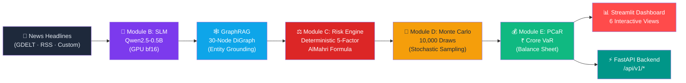

# CounterVerse — Causal AI Supply Chain Disruption Simulator

> **Scenario-based causal simulation** for Indian automotive semiconductor supply chains.  
> Headline intelligence → GraphRAG entity grounding → deterministic risk scoring → Monte Carlo → Procurement Cost at Risk (PCaR).

[](https://python.org)
[](https://streamlit.io)
[](https://fastapi.tiangolo.com)
[](LICENSE)

---

## What It Does

CounterVerse transforms unstructured news headlines into **quantified financial supply chain risk estimates** for the Indian automotive semiconductor corridor:

**Gallium/Germanium (HS 8112) → Semiconductor ICs (HS 8542) → Automotive ECU Assembly → Indian OEM Vehicle Production**

It does **not** predict the future from time-series data, access proprietary OEM procurement systems, or provide audited financial statements. All cost estimates are simulated under documented assumptions.

---

## Architecture



---

## Tech Stack

| Layer | Technology | Purpose |
|---|---|---|
| **SLM Inference** | Qwen2.5-0.5B-Instruct, PyTorch bf16 | Headline → structured disruption signal |
| **Entity Grounding** | NetworkX DiGraph (30 nodes, 69 edges) | GraphRAG entity verification |
| **Risk Scoring** | Deterministic 5-factor weighted formula | AlMahri et al. (2026) Section 3.2.5 |
| **Stochastic Engine** | NumPy Monte Carlo (10K draws) | Production drop distribution |
| **Financial Engine** | UN Comtrade HS 8542/8112 baselines | Procurement Cost at Risk (PCaR) in ₹ Crore |
| **Dashboard** | Streamlit + Plotly | 6-view executive decision interface |
| **REST API** | FastAPI + Pydantic | Headless enterprise integration |
| **News Ingestion** | GDELT 2.0 + RSS + SQLite cache | Resilient multi-source headline feed |
| **Persistence** | JSON + SQLite | Graph overlays & headline cache |

---

## Hardware Requirements

| Component | Minimum | Recommended |
|---|---|---|
| **GPU** | NVIDIA RTX 3050 Ti (4 GB VRAM) | RTX 4060+ (8 GB) |
| **CPU** | 4 cores | 8+ cores |
| **RAM** | 8 GB | 16 GB |
| **Disk** | 5 GB (model weights + data) | 10 GB |
| **OS** | Windows 10/11, Linux | Any with CUDA 12.x |

> **CPU-only mode:** The dashboard runs in `Fast Heuristic` mode without GPU. Only the Qwen SLM inference requires CUDA.

---

## Quickstart

### 1. Clone & Setup Environment

```bash
git clone <repository-url>
cd "sem 7"

# Create Python 3.11+ virtual environment
py -3.11 -m venv .venv
.venv\Scripts\activate          # Windows
# source .venv/bin/activate     # Linux/Mac

# Install PyTorch with CUDA (Windows RTX 3050 Ti)
pip install torch torchvision torchaudio --index-url https://download.pytorch.org/whl/cu128

# Install project dependencies
pip install -r requirements-local.txt
```

### 2. Configure Environment

```bash
cp .env.example .env
# Edit .env with your API keys (all optional — zero keys required for basic operation)
```

### 3. Verify Installation

```bash
python scripts/check_gpu.py        # Verify CUDA & VRAM
python test_grounding.py           # Verify GraphRAG entity verification
pytest tests/ -v                   # Run full test suite
```

### 4. Launch Dashboard

```bash
streamlit run app/dashboard.py
# Opens at http://localhost:8501
```

### 5. Launch REST API (Optional)

```bash
uvicorn api.main:app --host 0.0.0.0 --port 8000
# OpenAPI docs at http://localhost:8000/docs
```

### 6. Docker Launch (Optional)

```bash
docker compose up --build
# Dashboard: http://localhost:8501
# API:       http://localhost:8000/docs
```

---

## API Endpoints

| Method | Endpoint | Description |
|---|---|---|
| `POST` | `/api/v1/analyze-headline` | Full pipeline: SLM → GraphRAG → Risk Score → Directive |
| `POST` | `/api/v1/simulate-risk` | Monte Carlo simulation with custom parameters |
| `POST` | `/api/v1/calculate-pcar` | PCaR for predefined OEM or custom BOM |
| `GET`  | `/api/v1/health` | System status, GPU availability, graph integrity |

See interactive docs at `http://localhost:8000/docs` after launching the API.

---

## Dashboard Views

| View | Description |
|---|---|
| **01 — Decision Room** | Headline analysis, GraphRAG grounding, risk score, CSCO directive |
| **02 — Scenarios** | 10 pre-calibrated benchmark scenarios |
| **03 — Supply Chain** | Interactive 30-node supply chain graph |
| **04 — Impact & PCaR** | Multi-OEM financial risk allocation & Monte Carlo histograms |
| **05 — Validation** | SIAM 2021 backtest + Table 5 pipeline benchmark (Macro F1: 0.933) |
| **06 — Governance** | Parameter audit, 16 model limitations, viva defense guide |

---

## Project Structure

```
├── api/                    # FastAPI REST backend
│   └── main.py
├── app/                    # Streamlit dashboard
│   └── dashboard.py
├── src/                    # Core pipeline modules
│   ├── config.py           # Centralized settings (pydantic-settings)
│   ├── data_sources.py     # GDELT + RSS + SQLite + Comtrade data layer
│   ├── grounding_graph.py  # GraphRAG entity verification (30 nodes, 69 edges)
│   ├── module_b_slm.py     # SLM signal extractor (Qwen2.5-0.5B)
│   ├── module_c_causal.py  # Deterministic risk engine (AlMahri formula)
│   ├── module_d_mc.py      # Monte Carlo scenario engine (10K draws)
│   └── module_e_pcar.py    # PCaR financial loss engine + custom BOM
├── data/
│   ├── processed/          # Cached baselines, graph overlays, headline DB
│   ├── raw/                # Raw source data with SOURCE.md provenance
│   ├── synthesized_scenarios.json
│   └── evaluation_results.json
├── tests/                  # pytest test suites
├── scripts/                # GPU checks, evaluation harness, data fetchers
├── docs/                   # Assumptions, limitations, environment docs
├── Dockerfile
├── docker-compose.yml
└── requirements-local.txt
```

---

## Key Results (Phase 6 Post-Upgrade)

| Metric | Value | Threshold |
|---|---|---|
| **Pipeline Macro F1** | **0.933** | ≥ 0.750 ✅ |
| **Disruption Recall** | **1.000** (11/11) | = 1.000 ✅ |
| **False Alarm Specificity** | **100.0%** (4/4 rejected) | ≥ 80% ✅ |
| **SIAM 2021 Calibration Gap** | **-2.8pp** (P95 tail) | ≤ ±5.0pp ✅ |

---

## Honesty Disclaimer

- Sensitivity ±20% on CPTs is a **robustness check on assumptions**, not a confidence interval.
- PCaR numbers are **simulated under documented assumptions** using UN Comtrade macro trade volumes.
- This system does **not** predict future IIP or access proprietary OEM financials.

---

## Academic Credit

**Vidyavardhini's College of Engineering & Technology, Vasai**  
Department of Computer Science & Engineering (Data Science)  
BE Final Year Mini Project — Team of 4

**Reference:** AlMahri et al. (2026), "Automating Supply Chain Disruption Monitoring via an Agentic AI Approach"
